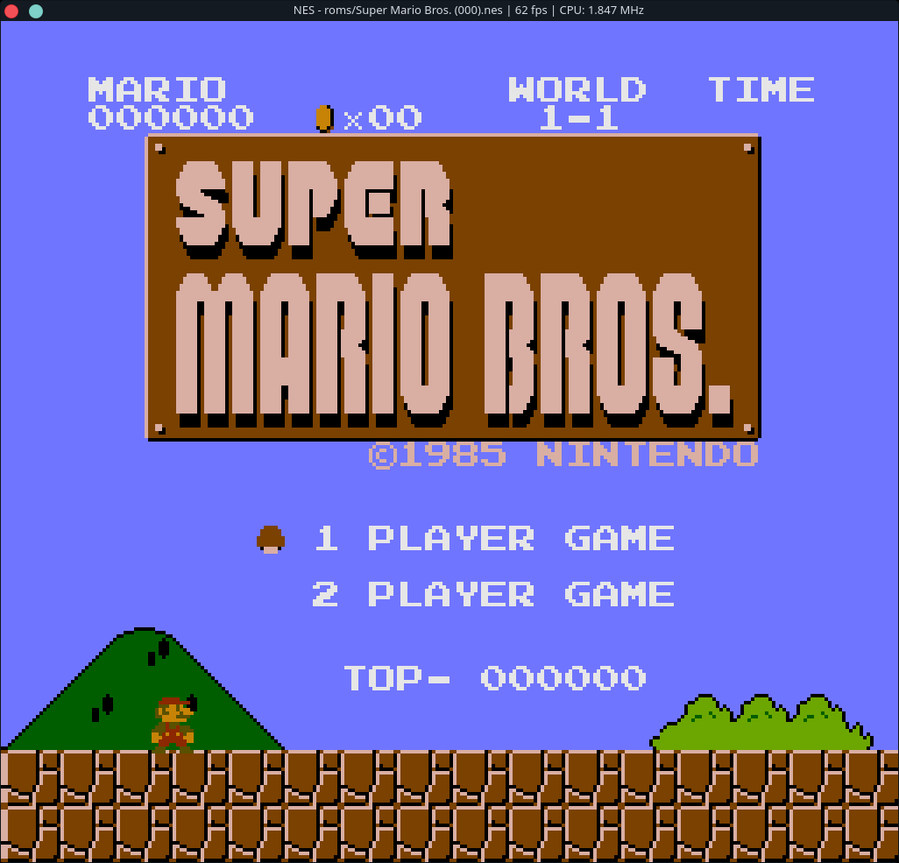
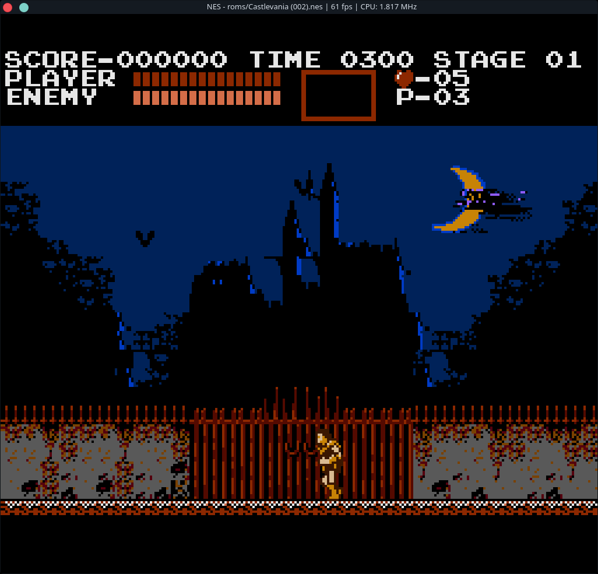
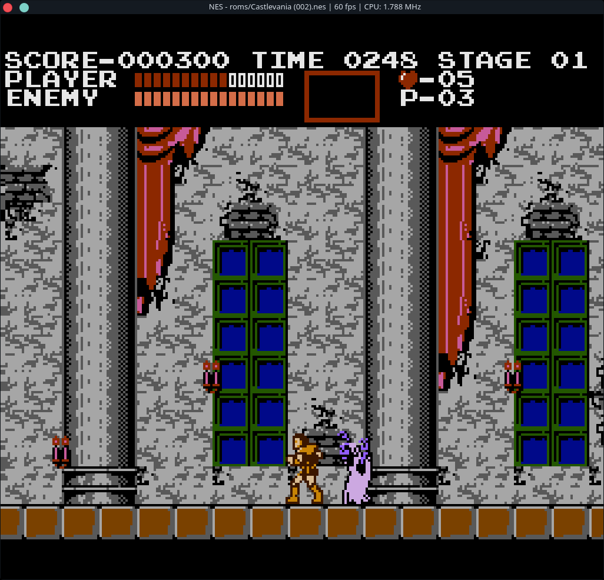
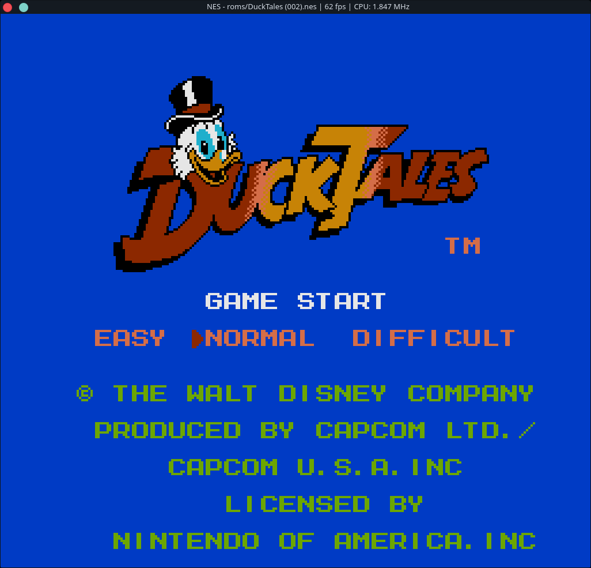
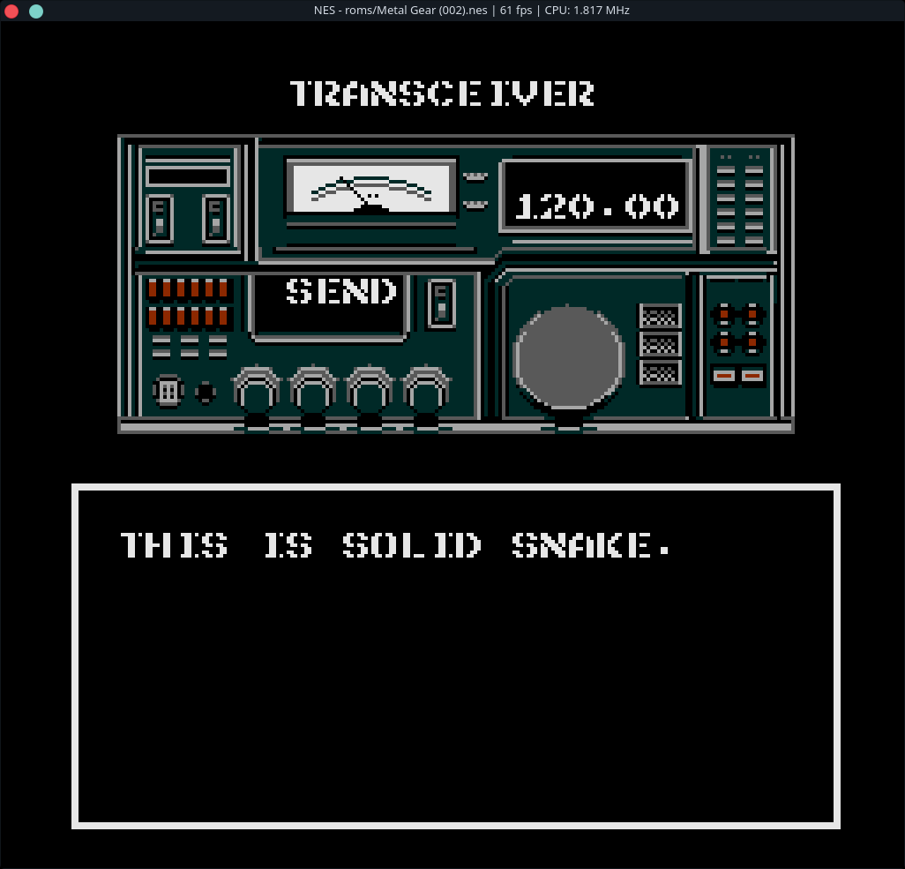
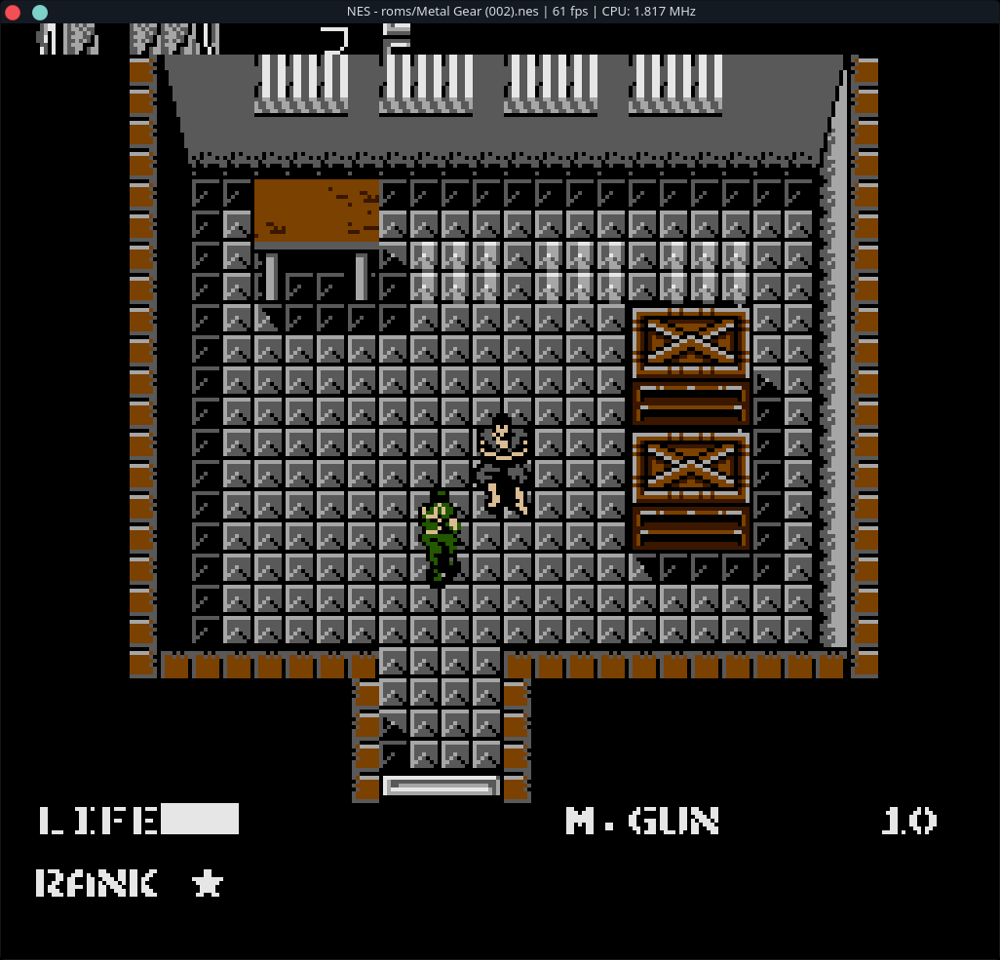
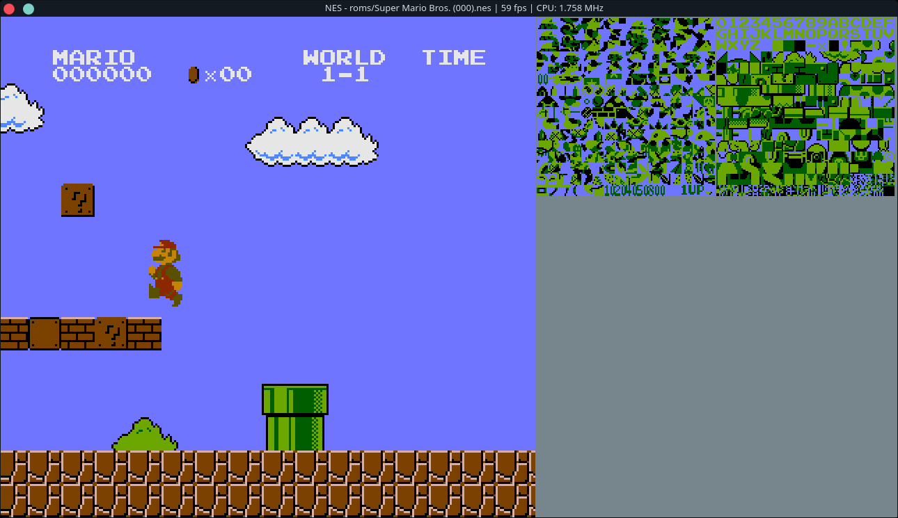
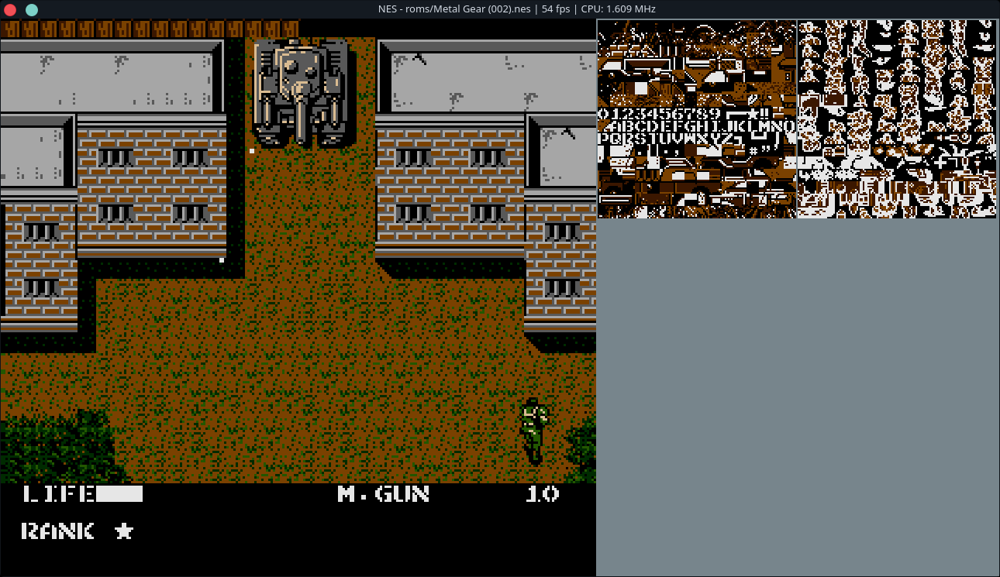

# NES Emulator
A nes emulator written in C and the SDL2 library. I created this as a hobby project for me to learn more about the nes architecture and emulation in general.
# Demos






# Demos with Debug View


# Resources
 * [Nesdev](http://wiki.nesdev.com/w/index.php/Nesdev_Wiki) is THE go-to resource for nes emulation and contains very little code so you don't "spoil" the fun of writing your own emulator.
 * [javidx9](https://www.youtube.com/channel/UC-yuWVUplUJZvieEligKBkA) did a fantastic [youtube series](https://www.youtube.com/watch?v=F8kx56OZQhg) on his nes emulator. This was a great resource for me when I hit a wall (especially the ppu). He provides a conceptual overview as well as some implementation details.
 * For the 6502 implementation, [this](http://obelisk.me.uk/6502/reference.html) was a great resource.
# Features
 * Full 6502 instruction (official and unoffical) emulation
 * Passes nestest
 * Supports Mappers 000, 001, 002 (which covers a large chunk nes games)
 * Most PPU features implemented
 * Simple PPU debug view
 * Partial Sound support (pulse1, pulse2, triangle)
# Missing Features
 * Small features of the PPU
 * Missing Noise channel, DMC, as well as sweep and envelope implementations need work on the other channels
 * All other mappers
# Dependencies
  * [Make](https://www.gnu.org/software/make/)
  * [gcc](https://gcc.gnu.org/)
  * Linux
  * [SDL2](https://www.libsdl.org/)
# Build with CMake
1. `mkdir build`
2. `cd build`
3. `cmake ..`
4. `make`
# Run
`nes <path to rom>`
# Key Bindings
```
NES BUTTON | KEY
===========|======
UP         | w
DOWN       | s
LEFT       | a
RIGHT      | d
A          | j
B          | k
START      | ENTER/RETURN
SELECT     | BACKSPACE
-----------|------
RESET      | ESC
PAUSE EMU  | p
TOGGLE CH1 | 1
TOGGLE CH2 | 2
TOGGLE CH3 | 3
```

